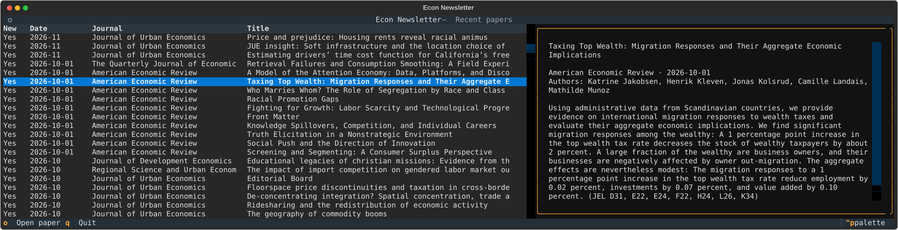

# Econ Newsletter

A personal economics paper collector and terminal browser. It fetches recent records from Crossref, stores them in a local SQLite database, and displays them in a Textual TUI.

## Setup

The project requires: 
- Python 3.14 or newer
- [uv](https://docs.astral.sh/uv/)

From the project directory, install the project and its dependencies:

```bash
uv sync
```

## Use

Collect recent papers from the configured journals:

```bash
uv run econ-newsletter-collector
```

Open the terminal interface:

```bash
uv run econ-newsletter
```

Use the arrow keys to browse papers, `o` to open the selected paper's URL in your web browser, and `q` to quit.



The collector requests 100 recent records per journal as a default configuration, sorted by publication date. Run it whenever you want to refresh the database. It can also be scheduled with cron; for example:

```cron
0 7 * * * cd /mnt/storage/Projects/econ-newsletter && uv run python src/econ_newsletter/collector.py >> collector.log 2>&1
```

## Journals

Edit [`journals.yaml`](journals.yaml) to change the journals. Each entry has a short ID, journal name, and ISSN. The current configuration includes:

- Journal of Urban Economics
- Regional Science and Urban Economics
- Review of Economics and Statistics
- Journal of Development Economics
- American Economic Review
- Quarterly Journal of Economics

Crossref metadata can be incomplete, and some records do not include an abstract. To include a contact email with Crossref requests, set the optional `CROSSREF_MAILTO` environment variable:

```bash
export CROSSREF_MAILTO="you@example.com"
```

## Local database

The collector creates `papers.db` in the project root. The database stores each paper's DOI, title, authors, journal, abstract, URL, publication date, first-seen timestamp, source, raw Crossref metadata, and new-record flag.

DOI is the primary key, so collecting a paper again updates its metadata instead of creating a duplicate. `published_at` is the publication date supplied by Crossref; `first_seen_at` records when the paper was first saved locally. The database is local application data and is ignored by Git.